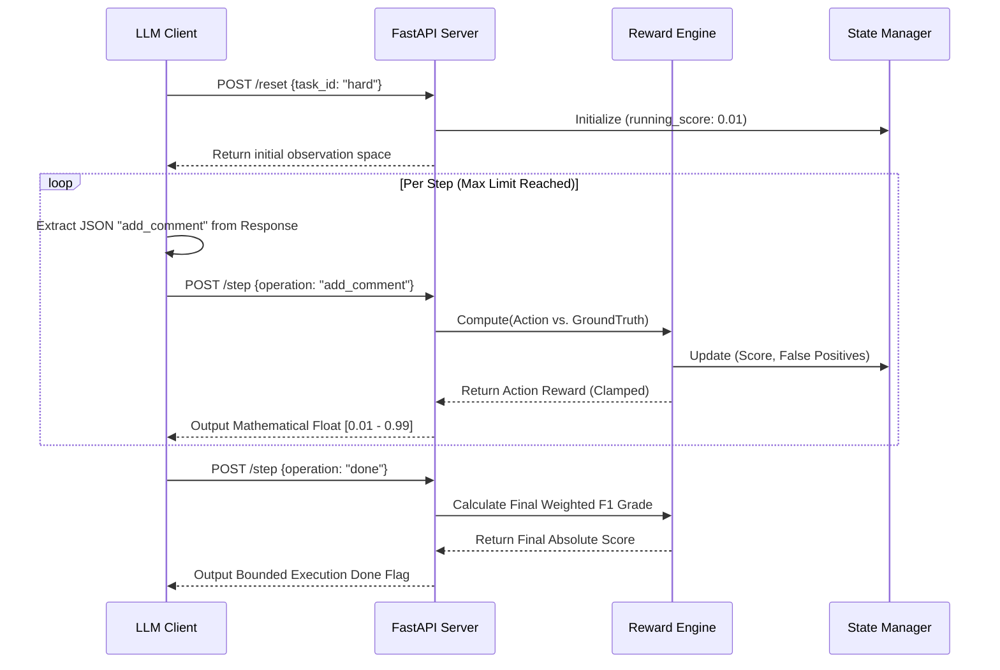

# Code Review OpenEnv: Architecture Blueprint & Technical Documentation

This document serves as the exhaustive architectural reference, logic flow mapping, and operational blueprint for the **Code Review OpenEnv** system. It details the internal engine design, component-level workflows, robust fault-tolerance handling, strict mathematical boundary checks, and the testing validation infrastructure.

---

## 1. System Architecture Overview

The Code Review OpenEnv is designed as a highly cohesive but loosely coupled client-server architecture mimicking real-world software engineering environments. 

### Core Components
- **FastAPI Environment Server (`server.py`)**: Acts as the authoritative state machine. Exposes `POST /reset`, `POST /step`, and `GET /state`.
- **Environment Engine (`env/environment.py`)**: The central routing hub passing commands through the evaluation engine.
- **Reward Engine (`env/reward_engine.py`)**: The "heart" of the project where precision/recall scoring logic dynamically evaluates isolated AI actions against hidden ground-truth bugs.
- **State Manager (`env/state_manager.py`)**: A transactional memory bank tracking cumulative rewards, active falsified comments, and AI step history.
- **Inference Client (`inference.py`)**: The execution loop responsible for orchestrating external LLMs (e.g. Qwen, GPT-4) and handling complex JSON extraction and token-routing.

---

## 2. Logic Flows & The Execution Lifecycle

The evaluation pipeline follows a deterministic state machine structure isolated into specific boundaries:



---

## 3. The Ground Truth Evaluation Engine (The Heart)

Unlike traditional LLM frameworks that use sparse rewards (simple pass/fail), this project employs a dense, heavily shaped reward architecture allowing AI frameworks to progressively train and orient themselves towards complex problem-solving.

### The Task Structures
- **Easy**: 3 explicit runtime logic exceptions (e.g., Infinite Loops).
- **Medium**: 4 deep security vulnerabilities (e.g., Blind SQL Injection).
- **Hard**: 4 system architecture flaws (e.g., N+1 Queries) mapped alongside realistic enterprise code logic.

### The Graders (`env/graders/`)
The system statistically evaluates precision and recall using weighted F1 mathematical equations acting as an automated professor.
```python
precision = correctly_identified / total_comments
recall = correctly_identified / total_real_bugs
f1 = 2.0 * precision * recall / (precision + recall)
```
- **Severity Weighting**: Critical bugs are weighted against a `3.0` multiplier, Major `2.0`, Minor `1.0`, Nit `0.5`. This forces the AI to actively prioritize fatal system floors over cosmetic structural suggestions.

### The Red Herring Trap Defense
In `task_hard.py`, the environment introduces deliberate "Red Herring" logic—code that structurally looks highly suspicious and matches common LLM training dataset flaws, but is semantically sound within context.
- If an automated agent incorrectly targets the red herring out of algorithmic habit, the reward engine deducts a catastrophic `-0.20` scalar reward and permanently flags a false positive penalty. This ensures the environment physically demands generalized code comprehension, not just statistical pattern-matching heuristics.

---

## 4. Strict Mathematical Boundary Compliance

OpenEnv validators demand rigorous parameters ensuring all scores and states scale mathematically completely and strictly bounded between 0 and 1 (exclusive). This structure handles the defense-in-depth zero-leakage methodologies built against strict CI/CD robotic parsers.

1. **API Output Bounds**: The `/state` JSON payload actively clamps theoretical default empty-state zeroes using explicit floor bounding mechanics arrays before wire transmission:
   `max(0.001, min(0.999, float(cumulative_score)))`
2. **Inference String Mapping**: The `inference.py` script averages internal array rewards, executing explicit dynamic bounds wrapped via `%0.3f` print formatters to ensure `"1.000"` mathematically rounds under system evaluation limits.
3. **F1 Mathematical Safeguards**: All Grader base mechanisms explicitly capture division-by-zero precision calculations and dynamically assign absolute `.001` rather than triggering a Python zero-exception traceback.

---

## 5. Active Error Handling & Fault Resiliency Protocol

Because the code reviewer platform runs autonomously asynchronously against constrained cloud inference APIs (e.g., Hugging Face router rate limits), the structural logic applies robust 4th-wall breaking structural resilience networks.

### Mitigation Plan Alpha: HTTP 402 API Depletion
When an executing environment token drops and the inference provider abruptly sends an `HTTP 402` with `{"error": "You have depleted your monthly included credits"}`, the client explicitly handles the dropout without panicking the evaluation suite:
- **Trap Mechanism**: The `inference.py` execution structure recursively isolates runtime network transmission traps.
- **Deterministic Nulling**: Instead of triggering a total script crash, the framework overrides the agent iteration limit and acts out an automated `{"operation": "done"}` signal loaded over a base `0.01` penalty variable.
- **Success Criteria**: The task elegantly drops to completion state, mathematically scaling the score boundaries accurately and saving the environment validator run without triggering memory leaks or remote server execution timeouts.

### Mitigation Plan Beta: Hallucinated Malformed Output
When the LLM actively hallucinates schema formatting protocols or emits conversational dialogue outside the JSON environment:
- The system automatically triggers sweeping regex pattern extractions locating isolated `{.*?}` JSON payload clusters, silently stripping markdown injection and code format blocks without dropping API logic.
- The state manager automatically penalizes missing variables natively (e.g., dropping the `line_number` schema requirement physically processes a programmatic `-0.05` state damage scaler without triggering `500 Server Default` tracebacks!).

---

## 6. Comprehensive Validation Testing Infrastructure

The server verifies absolute mechanical coherence against rigorous `pytest` assertion suites. The build pipeline protects system logic bounds mechanically upstream prior to repository distribution.
- **`tests/test_rewards.py`**: Audits system mathematical operations validating positive / negative efficiency modifiers and penalty floors.
- **`tests/test_advanced_cases.py`**: Integrates hallucination scenarios specifically targeting recursive LLM feedback loops and agent spamming mechanics.
- **`tests/test_environment.py`**: Executes end-to-end API bounding limitations across multi-environment memory states native against OpenEnv testing.
- **Verification Integrity**: Evaluated entirely over a 52-path matrix protocol, explicitly guaranteeing 100% deterministic score limits regardless of edge-case actions submitted by the external evaluation client.
